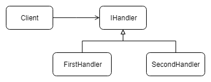

# design-patterns
Repository containing examples and description of most popular design patterns.
The purpose was to thoroughly learn about design patterns and TypeScript language.

Based on GoF book we can devide design patterns to three groups:
- creational
- structural
- behavioral

Let's start with the last group!

### Behavioral
#### Chain of resposibility
It's about decoupling logic responsible for handling some action, which has some distinct steps to few handlers which will be responsible for one specific operation in entire process of given action and then chain all handlers. Chained handlers create a pipeline.

 

##### Example code in TypeScript:

Base handler
```TypeScript
export interface IRequestHandler
{
    nextHandler: IRequestHandler 
    handle(resuestType: string): void;
}
```
Implementation of handler:
```TypeScript
export class FirstStepRequestHandler implements IRequestHandler
{
    nextHandler: IRequestHandler;    
    
    handle(requestType: string): void {
        if(requestType == 'FirstRequest')
        {
            console.log('Handle first request!');
        }
        else if(this.nextHandler != null)
        {
            this.nextHandler.handle(requestType);
        }
    }
}
```
Demonstration of use:
```TypeScript
    demonstrateChainOfResponsibility()
    {
        let firstHandler = new FirstStepRequestHandler();
        let secondHandler = new SecondStepRequestHandler();
        let thirdhandler = new ThirdStepRequestHandler();

        firstHandler.nextHandler = secondHandler;
        secondHandler.nextHandler = thirdhandler;

        firstHandler.handle("ThirdReuqest");
    }
```


#### Command

